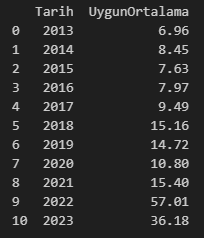

# Veri Kaynakları

## 1. İş Yatırım


İş Yatırım'da bulunan hisse senetlerine ait tarihsel verilere [buradan](https://www.isyatirim.com.tr/tr-tr/analiz/hisse/Sayfalar/Tarihsel-Fiyat-Bilgileri.aspx) ulaşabilirsiniz.

Sayfaya ulaştıktan sonra F12'ye basın. F12'ye basmak ile sayfanın herhangi bir bölümüne sağ tıklayıp *İncele* dedikten sonra *Network* seçeneğine tıklamak aynı şeydir. İki seçenekten birini yaptıktan sonra F5'e ya da Ctrl + R tuşlarına basın. Bu işlemler gerçekleştirildikten sonra solda bulunan *Name* bölümündeki satıra tıklayın. Sağda çıkan *Request URL* ile hisselerin tarihsel fiyatlarına ulaşabileceğiz.


Request URL'de 3 adet bilgiyi fonksiyonda parametre olarak tanıtacağız. Bunlar; hisse ismi (bir veya birden fazla), başlangıç ve bitiş tarihidir.

Parametreler ile beraber URL nasıl oluşacak?

```python
# Parametreler

ticker = "SASA"
startDate = "01-06-2023"
endDate = "09-06-2023"

# URL

my_url = "https://www.isyatirim.com.tr/_layouts/15/Isyatirim.Website/Common/Data.aspx/HisseTekil?"
my_url += "hisse={}&startdate={}&enddate={}".format(ticker, startDate, endDate)

print(my_url)
```

Sonuç olarak elde edeceğimiz URL aşağıdaki gibi olacak.

```
https://www.isyatirim.com.tr/_layouts/15/Isyatirim.Website/Common/Data.aspx/HisseTekil?hisse=SASA&startdate=01-06-2023&enddate=09-06-2023
```

Yukarıdaki URL'i tarayıcınıza yapıştırıp çalıştırabilirsiniz. Görüntü aşağıdaki gibi olacaktır. Karışık gibi görünse de düzenli bir formatta almış olacağız.


Verileri çekerken kullanacağımız yukarıdaki URL'in sonuna .json uzantısını ekleyeceğiz. JSON, veri iletimini kolaylaştıran bir veri transferi formatıdır.

```python
# Parametreler

ticker = "SASA"
startDate = "01-06-2023"
endDate = "09-06-2023"

# URL

my_url = "https://www.isyatirim.com.tr/_layouts/15/Isyatirim.Website/Common/Data.aspx/HisseTekil?"
my_url += "hisse={}&startdate={}&enddate={}.json".format(ticker, startDate, endDate)

print(my_url)
```

Nihai URL aşağıdaki gibi olacaktır.

```
https://www.isyatirim.com.tr/_layouts/15/Isyatirim.Website/Common/Data.aspx/HisseTekil?hisse=SASA&startdate=01-06-2023&enddate=09-06-2023.json
```

Örnek URL'i kullanarak verileri alabiliriz.

```python
import pandas as pd
import requests
import json

# Parametreler

ticker = "SASA"
startDate = "01-06-2023"
endDate = "09-06-2023"

# URL

my_url = "https://www.isyatirim.com.tr/_layouts/15/Isyatirim.Website/Common/Data.aspx/HisseTekil?"
my_url += "hisse={}&startdate={}&enddate={}.json".format(ticker, startDate, endDate)

print(my_url)

result = json.loads(requests.get(my_url).text)
df_hist = (
    pd.DataFrame(result['value'])
    .loc[:, ['HGDG_HS_KODU', 'HGDG_TARIH', 'HGDG_KAPANIS']]
    .rename(columns={'HGDG_HS_KODU': 'Ticker', 'HGDG_TARIH': 'Date', 'HGDG_KAPANIS': 'Close'})
)

print(df_hist)
```

Özetle, yukarıdaki işlemlerde bir URL'den bir JSON verisi alındı ve bu veri Python veri yapılarına dönüştürüldü.

Fonksiyonu oluşturma aşamasına geçebiliriz.

Önce yazılacak fonksiyonu açıklamak isterim.

* ticker, startDate ve endDate isminde 3 tane parametre tanımlanacak.
* If ile yukarıdaki parametreler kontrol edilecek. Eğer bu parametreler girilmediyse ekrana bir mesaj gönderilecek.
* Eğer parametreler girildiyse master ismindeki veri çerçevesine çekilen tarihsel veriler kaydedilecek ve verilerin nihai hali döndürülecek.

```python
import pandas as pd
import requests
import json

# ticker parametresi ['...'] ya da ['...','...'] şeklinde girilmelidir.
# startDate ve endDate parametreleri 'dd-mm-yyyy' şeklinde girilmelidir.

def histPrices(ticker = None, startDate = None, endDate = None):
    if ticker is None or startDate is None or endDate is None:
        print("Field is required! You have left a field empty and a value must be entered.")
    else:
        master = pd.DataFrame()

        for tick in ticker:
            my_url = "https://www.isyatirim.com.tr/_layouts/15/Isyatirim.Website/Common/Data.aspx/HisseTekil?"
            my_url += "hisse={}&startdate={}&enddate={}.json".format(tick, startDate, endDate)

            result = json.loads(requests.get(my_url).text)
            df_hist = (
                pd.DataFrame(result['value'])
                .loc[:, ['HGDG_HS_KODU', 'HGDG_TARIH', 'HGDG_KAPANIS']]
                .rename(columns={'HGDG_HS_KODU': 'Ticker', 'HGDG_TARIH': 'Date', 'HGDG_KAPANIS': 'Close'})
            )

            master = pd.concat([master, df_hist])

        return master
```

Fonksiyonları test edelim.

* Test-1: Bir tane parametre bilgisi girilmesin.

```python
histPrices(
    startDate = '01-06-2023',
    endDate = '09-06-2023'
)
```

Çıktı:

```
Field is required! You have left a field empty and a value must be entered.
```

* Test-2: Parametre bilgileri eksiksiz girilsin. Hisse sayısı 1 olsun.

```python
histPrices(
    ticker = ['SASA'],
    startDate = '01-06-2023',
    endDate = '09-06-2023'
)
```

Çıktı:


* Test-3: Parametre bilgileri eksiksiz girilsin. Hisse sayısı 2 olsun.

```python
histPrices(
    ticker = ['SASA','THYAO'],
    startDate = '01-06-2023',
    endDate = '09-06-2023'
)
```

Çıktı:


## 2. TCMB (Türkiye Cumhuriyet Merkez Bankası)


TCMB'nin Elektronik Veri Dağıtım Sistemi olan EVDS'ye [buradan](https://evds2.tcmb.gov.tr/) ulaşılabilir. Sayfada yer alan [Kullanıcı Dokümanları](https://evds2.tcmb.gov.tr/index.php?/evds/userDocs) başlığına ise tıklanıp [Web Servis Kullanım Kılavuzu](https://evds2.tcmb.gov.tr/help/videos/EVDS_Web_Servis_Kullanim_Kilavuzu.pdf)'na erişilebilir. TCMB bu doküman ile web servis metotlarının parametrelerini açıklamış.

Aynı sayfada yer alan [Giriş Yap](https://evds2.tcmb.gov.tr/index.php?/evds/login) bölümüne giriyoruz. Daha önce kayıt olmadıysanız *Kayıt Olun* seçeneği ile kayıt işleminizi yapabilirsiniz. Verdiğiniz mail adresine bir *TCMB EVDS Aktivasyon Kodu* gelecektir. Ardından *kullanıcı adı*, *parola* ve *doğrulama kodu* ile giriş yapılabilir. Bundan sonra bir API anahtarına ihtiyacınız olacak. Bunun için de isminizin ve soyisminizin yer aldığı yerden profilinize gidip *API Anahtarı* butonuna tıklayabilirsiniz. Tıklamanın ardından tarayıcınızda çıkan bir mesaj ile API anahtarınız verilecektir. Bunu bir seçenek kopyalayıp bir objeye aşağıdaki gibi kaydedebilirsiniz.

```python
my_api_key = 'API_ANAHTARINIZ'
```

**Kütüphaneler:**

```python
import pandas as pd
import requests
import json
```

**Kategoriler:**

Dokümanda 4 no'lu *EVDS Metaveri web servisleri* başlığı altındaki 4.1 no’lu *Konu Başlığı Servisi* alt başlığında bulunmaktadır.

*Tüm konu başlıklarını sunan bir servistir. Bu servisi temsilen "https://evds2.tcmb.gov.tr/service/evds/" tanımından sonra "categories" eklenmelidir.*

```
https://evds2.tcmb.gov.tr/service/evds/categories/key=XXXXXX&type=json
```

```python
my_url = "https://evds2.tcmb.gov.tr/service/evds/categories/key="
my_url += "{}&type=json".format(my_api_key)

result = json.loads(requests.get(my_url).text)
result = (
    pd.DataFrame(result)
    .loc[:, ['CATEGORY_ID', 'TOPIC_TITLE_TR']]
)
print(result)
```

23 satırdan oluşan `result` objesini yarattık.


Kategoriler bölümünden sonra seçtiğiniz kategori ile devam edebilirsiniz. Ben *anketler* ile devam etmeyi seçtim.

Anketler kategorisinin ID'sinin kaç olduğuna bakalım.

```python
kategori_id = result.query('TOPIC_TITLE_TR == "ANKETLER"')['CATEGORY_ID'].values[0]
print(kategori_id)
```

Anketler ID'sinin 15 olduğunu öğrendik.

**Veri Grupları**

Dokümanda 4 no'lu *EVDS Metaveri web servisleri* başlığı altındaki 4.2 no'lu *Veri Grubu Servisi* alt başlığında bulunmaktadır.

*İlgili Konu başlığı bazında ya da tek bir veri grubunun metaveri bilgilerini listeleyen bir servistir. Bu servisi temsilen "https://evds2.tcmb.gov.tr/service/evds/" tanımından sonra "datagroups" eklenmelidir.*

Aşağıda verilen örnektir.

```
https://evds2.tcmb.gov.tr/service/evds/datagroups/key=XXXX&mode=1&code=bie_yssk&type=json
https://evds2.tcmb.gov.tr/service/evds/datagroups/key=XXXX&mode=2&code=2&type=json
```

Verilen örneklerde mode=1 ve mode=2 olarak verilse de biz mode=0 olarak kullanacağız. Çünkü tüm konu başlıkları altındaki tüm veri gruplarını göreceğiz.

```python
my_url2 = "https://evds2.tcmb.gov.tr/service/evds/datagroups/key="
my_url2 += "{}&mode=0&type=json".format(my_api_key)

result2 = json.loads(requests.get(my_url2).text)
result2 = (
    pd.DataFrame(result2)
    .query('CATEGORY_ID == @kategori_id')
    .loc[:, ['DATAGROUP_CODE', 'DATAGROUP_NAME', 'FREQUENCY', 'START_DATE', 'END_DATE']]
)
print(result2)
```


15 no'lu ID'yi filtreleyerek 18 satırlık `result2` objesine ulaştık. Buradan ise *Piyasa Katılımcıları Anketi Tanımsal İstatistikleri*'nin koduna ulaşacağız.

```python
verigrubu_id = result2.query("DATAGROUP_NAME.str.contains('Piyasa Katılımcıları Anketi Tanımsal İstatistikleri')")['DATAGROUP_CODE'].values[0]
print(verigrubu_id)
```

Piyasa Katılımcıları Anketi Tanımsal İstatistikleri kodunun bie_urbek olduğunu öğrendik.

**Seriler**

Dokümanda 4 no'lu *EVDS Metaveri web servisleri* başlığı altındaki 4.3 no'lu *Seri Listesi Servisi* alt başlığında bulunmaktadır.

*Seri listesini veri grubu ya da seri kodu bazında sunan bir servistir. Bu servisi temsilen "https://evds2.tcmb.gov.tr/service/evds/" tanımından sonra "serieList" eklenmelidir.*

Aşağıda verilen örnektir.

```
https://evds2.tcmb.gov.tr/service/evds/serieList/key=XXXXX&type=json&code=TP.DK.USD.A
https://evds2.tcmb.gov.tr/service/evds/serieList/key=XXXXX&type=json&code=bie_yssk
```

```python
my_url3 = "https://evds2.tcmb.gov.tr/service/evds/serieList/key="
my_url3 += "{}&type=json&code={}".format(my_api_key,verigrubu_id)

result3 = json.loads(requests.get(my_url3).text)
result3 = (
    pd.DataFrame(result3)
    .loc[:, ['SERIE_CODE', 'SERIE_NAME', 'DEFAULT_AGG_METHOD']]
)
print(result3)
```


bie_urbek isimli veri grubu kodunu filtreleyerek 320 satırlık `result3` objesine ulaştık. Artık buradan verilere ulaşabiliriz. Ulaşmak istediğimiz veri *(Uygun Ortalama) Cari Yıl Sonu Yıllık TÜFE Beklentisi (%)* olacak. Bu veriye ulaşmak için ise seri koduna ihtiyacımız olacak.

```python
seri_id = result3.query("SERIE_NAME in ['1D.(Uygun Ortalama) Cari Yıl Sonu Yıllık TÜFE Beklentisi (%)']")['SERIE_CODE'].values[0]
print(seri_id)
```

"En Uygun" istatistiği ile Cari Yıl Sonu Yıllık TÜFE Beklentisi verileri için seri kodunun TP.BEK.S01.D.U olduğunu öğrendik.

**Veriler**

Son olarak verileri alabiliriz. Aşağıdaki URL'i kullanacağız.

```
https://evds2.tcmb.gov.tr/service/evds/series=
```

URL'in sonrası parametrelerin eklenmesi ile tamamlanacak. Dokümanda bununla ilgili açıklayıcı örnekler bulunmaktadır.

Aşağıda verilen örnektir.

```
https://evds2.tcmb.gov.tr/service/evds/series=TP.DK.USD.S.YTL&startDate=01-01-2005&endDate=01-02-2017&type=xml&key=XXXX&aggregationTypes=avg&formulas=1&frequency=8
```

2013 yılından itibaren yıl bazında ortalama değerleri almak istediğimizi varsayalım.

```python
startDate = "01-01-2013"
endDate = "01-06-2023"
aggType = "avg"
formulas = "0"
freq = "8"

my_url4 = "https://evds2.tcmb.gov.tr/service/evds/series="
my_url4 += "{}&startDate={}&endDate={}&type=json&key={}&aggregationTypes={}&formulas={}&frequency={}".format(seri_id,startDate,endDate,my_api_key,aggType,formulas,freq)

result4 = json.loads(requests.get(my_url4).text)
final_data = (
    pd.DataFrame(result4['items'])
    .rename(columns={list(result4['items'][0].keys())[1]: "UygunOrtalama"})
    .iloc[:, [0,1]]
)
final_data['UygunOrtalama'] = pd.to_numeric(final_data['UygunOrtalama']).apply(lambda x: round(x, 2))
print(final_data)
```



***Bu veri kaynağının kapsamlı fonksiyonunu ekleyeceğim.***

## 3. FRED (Federal Reserve Economic Data)


FRED, Federal Reserve Economic Data'nın kısaltmasıdır ve çok sayıda ulusal, uluslararası, kamu ve özel kaynaktan alınan yüz binlerce ekonomik verilere ait zaman serilerinden oluşan çevrim içi bir veri tabanıdır. FRED, 12 bölgeye ait 12 adet Federal Rezerv Bankası'ndan biri olan St. Louis FED araştırma departmanı tarafından oluşturulmuş ve sürdürülmektedir. Birazdan kullanacağımız FRED API ise 2009 yılında yayınlanmıştır. FRED API ile ilgili detaylı bilgiye [buradan](https://fred.stlouisfed.org/docs/api/fred/) ulaşabilirsiniz.

Öncelikle, 32 karakterli bir alfanümerik string olan API anahtarını almak gerekiyor. API anahtarı [buradan](https://fredaccount.stlouisfed.org/login/secure/) alınabilir.

URL'e tıklayınca iki seçenek ile karşılaşacaksınız:

i. *Sign In* bölümünden Google hesabınız veya email ve şifreniz ile giriş yapabilirsiniz.

ii. *Create New Account* bölümünden yeni bir hesap oluşturabilirsiniz.

Benim tercihim Google hesabım ile hesap açmak olduğu için *Register with Google*'a tıkladım. Tıkladıktan sonra hesabım oluşturuldu. Otomatik olarak karşıma çıkan diğer ekranı ise doldurdum. Ardından sağ üst köşede yer alan *My Account*'a tıklayıp *API Keys* sayfasına ulaştım.

Son olarak *Request API Key* butonuna tıklıyoruz. Uygulamamız veya programımız hakkında bilgi istediği alana birkaç bir şey yazıp altındaki kutucuğu doldurduktan sonra *Request API Key* butonuna tıklayabiliriz.

```
Your registered API key is: API_ANAHTARINIZ Documentation is available on the St. Louis Fed web services website.
```

Verilen API anahtarı hesapta kayıtlı olacaktır. İstenildiği zaman ulaşılabilir veya kaldırılabilir.

API anahtarımızı bir seçenek kopyalayıp bir objeye aşağıdaki gibi kaydedebiliriz.

```python
my_api_key = 'api_anahtariniz'
```

Belki daha esnek olanı bir yere (notepad gibi) kaydetmek olabilir.


Dosyayı import edelim.

```python
with open('fred_api.txt', 'r') as file:
    my_api_key = file.read()
```

**Kütüphaneler**

```python
import requests
import pandas as pd
from pandas.io.json import json_normalize
```

İstekleri göndermeden önce bir not: İstekler, yayınlar ve seriler için 1,000 ile sınırlandırılmıştır. Gerçi bize yeterli olacaktır.

**Yayınlar (Releases)**

FRED’in veriler ile ilgili yayın detaylarına aşağıdaki gibi ulaşılabilir.

```
fred/releases - Get all releases of economic data.
```

```python
my_releases_url = 'https://api.stlouisfed.org/fred/releases?api_key={}&file_type=json'.format(my_api_key)

result1 = requests.get(my_releases_url).json()
df_releases = json_normalize(result1['releases'])[['id','name']]
print(df_releases)
```


**Seriler (Series)**

FRED’in yayınlarından ilgilendiğimiz ID’yi seçip bu ID altında bulunan serilere bakabiliriz. Örneğin 279 no’lu ID’ye bakalım.

```
279: Economic Policy Uncertainty
```

```
fred/release/series - Get the series on a release of economic data.
```

```python
my_release_id = 279

my_release_url = 'https://api.stlouisfed.org/fred/release/series?release_id={}&api_key={}&file_type=json'.format(my_release_id,my_api_key)

result2 = requests.get(my_release_url).json()
df_series = json_normalize(result2['seriess'])[['id','title','observation_start','observation_end','frequency','last_updated']]
print(df_series)
```


**Veriler (Data)**

Veriler için limit 100,000 ile sınırlandırılmıştır.

279 no'lu ID'nin birçok serisinin olduğunu göreceğiz. Bu serilerden USEPUINDXD ve USEPUINDXM'e bakalım.

```
USEPUINDXD: Economic Policy Uncertainty Index for United States (Daily, 7-day)
USEPUINDXM: Economic Policy Uncertainty Index for United States (Monthly)
```

```
fred/series/observations - Get the observations or data values for an economic data series.
```

* Economic Policy Uncertainty Index for United States (Daily, 7-day)

```python
# Günlük

my_series_id1 = "USEPUINDXD"

my_obs_url1 = 'https://api.stlouisfed.org/fred/series/observations?series_id={}&api_key={}&file_type=json'.format(my_series_id1,my_api_key)

result3 = requests.get(my_obs_url1).json()
df_data1 = json_normalize(result3['observations'])[['date','value']]
print(df_data1)
```


* Economic Policy Uncertainty Index for United States (Monthly)

```python
# Aylık

my_series_id2 = "USEPUINDXM"

my_obs_url2 = 'https://api.stlouisfed.org/fred/series/observations?series_id={}&api_key={}&file_type=json'.format(my_series_id2,my_api_key)

result4 = requests.get(my_obs_url2).json()
df_data2 = json_normalize(result4['observations'])[['date','value']]
print(df_data2)
```


Basit bir fonksiyon yazalım.

```python
def fred(api=None, series=None, startDate='1776-07-04', endDate='9999-12-31', frequency=None):
    ##### Some Frequencies #####
    # d = Daily -> Günlük
    # m = Monthly -> Aylık
    # a = Annual -> Yıllık
    ###########################

    ##### Date Format #####
    # YYYY-MM-DD
    # Default start date: 1776-07-04
    # Default end date: 9999-12-31
    ###########################

    if (api is None or series is None or frequency is None):
        print('Field is required! You have left a field empty and a value must be entered.')
    else:
        master = pd.DataFrame()

        for s in range(len(series)):
            my_obs_url = (
                'https://api.stlouisfed.org/fred/series/observations?series_id='
                + series[s]
                + '&observation_start='
                + startDate
                + '&observation_end='
                + endDate
                + '&frequency='
                + frequency
                + '&api_key='
                + api
                + '&file_type=json'
            )
            result = requests.get(my_obs_url).json()
            df_data = pd.DataFrame(result['observations'])[['date', 'value']]
            df_data['type'] = series[s]
            master = master.append(df_data)
        return master
```

Test edelim.

* Test-1: Herhangi bir parametre girmeyelim.

```python
fred()
```

Çıktı:

```
Field is required! You have left a field empty and a value must be entered.
```

* Test-2: Tüm bilgileri girelim.

```python
df = fred(
    api=my_api_key,
    series=['USEPUINDXM', 'EUEPUINDXM', 'RUSEPUINDXM'],
    startDate='2000-01-01',
    endDate='2022-12-01',
    frequency='a'
)

print(df)
```

Çıktı:


***Bu veri kaynağının kapsamlı fonksiyonunu ekleyeceğim.***